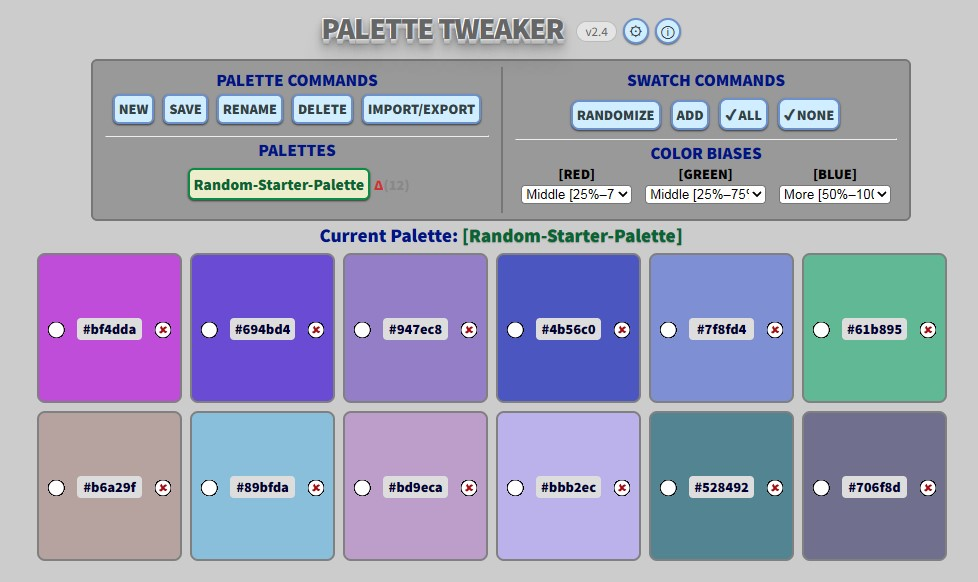

# Palettes

A small browser tool for building and editing color palettes. It generates
semi-random colors that you can guide with per-channel constraints.

**Try it:** [dffmonolith.github.io/palettes](https://dffmonolith.github.io/palettes/)

Palettes was originally called **Palette Tweaker**. I built it in 2016, and
in 2026 I ported it from jQuery to plain vanilla JavaScript and renamed it.

## What it does

- **Random palettes with constraints:** generate a palette of random
  colors, or bias generation by limiting the range of the red, green and
  blue components for each palette.
- **Keep what you like:** mark swatches as keepers so randomizing replaces
  only the others.
- **Fine-tune:** nudge any swatch's R, G or B value up or down, replace a
  color by typing it, or drop a swatch.
- **Arrange:** drag swatches to reorder them. Palettes never re-sorts them.
- **Many palettes:** create, rename, switch between and delete named
  palettes.
- **Import, export and merge:** move palettes in and out as plain text
  color lists.
- **Saved in your browser:** palettes and settings are stored in
  `localStorage`. Nothing is sent anywhere.
- **Includes a decimal/hex converter** for the occasional quick conversion.

## Running it

There's nothing to install or build. Download or clone the repository and
open `Palettes.html` in a browser. `Palettes-Help.html` is the full user
guide, which you can also open with the ⓘ button in the app.

Everything is plain HTML, CSS and JavaScript with no dependencies:

| File | Purpose |
|---|---|
| `Palettes.html` | The app |
| `Palettes.js` | All the logic (a single IIFE module, `Palettes`) |
| `Palettes.css` | Styles for the app and the help page |
| `Palettes-Help.html` | User guide |
| `docs/`, `includes/` | Help-page screenshots and UI icons |

## Upgrading from Palette Tweaker

Version 2.5 renamed the app's `localStorage` keys from `PaletteTweaker-*`
to `Palettes-*`. The first time you open 2.5 in a browser where you used
Palette Tweaker, it copies your saved palettes and settings to the new
keys automatically. This only works on the same site (origin) where you
saved them.

## License

[MIT](LICENSE) © 2016–2026 Dennis F. Freeze
